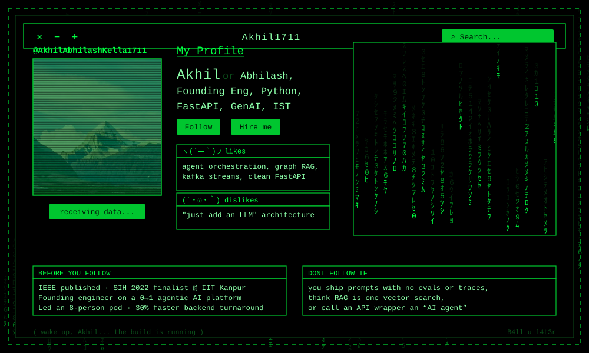

<div align="center">



</div>

```
akhil@matrix:~$ whoami --verbose

  NAME       Kella Akhil Abhilash
  ROLE       Founding Engineer — 0→1 agentic AI automation platform
  FOCUS      Python backend · FastAPI microservices · GenAI / LLM systems
  EXP        3+ years shipping production AI backends
  EDU        B.Tech CSE (AI/ML), GMR Institute of Technology · 2019–2023
  TZ         IST (UTC+05:30)

akhil@matrix:~$ cat signal.log

  [OK]  Real-time data platforms — event streaming, stream processing,
        knowledge graphs at enterprise scale
  [OK]  RAG, Graph RAG, tool calling, agent orchestration, connector
        execution, prompt engineering, LLM guardrails
  [OK]  Led an 8-member AI engineering pod
          backend turnaround   -30%
          workflow setup cost  -60%
          execution failures   -30%
  [OK]  Won Wexa-AI internal hackathon with "Pulse", an autonomous
        AI Product Manager — launched on Product Hunt
  [OK]  IEEE published — facial-landmark cursor control &
        speech-to-text for paralyzed individuals
  [OK]  Smart India Hackathon 2022 finalist @ IIT Kanpur

akhil@matrix:~$ _
```

<div align="center">

`─────────────  T H E   S T A C K   I   K N O W  ─────────────`

</div>

**`LANGUAGES`**

    

**`BACKEND / APIS`**

     

**`AI / LLM`**

         

**`DATA / STREAMING / CLOUD`**

        

**`FRONTEND`**

   

<div align="center">

`─────────────  W H A T   I ' V E   B U I L T  ─────────────`

</div>

| ░ | PROJECT | WHAT IT DOES |
|---|---|---|
| `01` | **Agentic AI Platform** — Wexa-AI | Founding engineer on a 0→1 enterprise AI automation platform: architecture, FastAPI microservices, scalability |
| `02` | **Intent-Based Connector Framework** | Maps user requests to tool actions, dynamically executes enterprise connector operations |
| `03` | **AI Coworker Generator** | Prompt-driven system turning minimal input into configured AI coworkers — **60% less setup effort** |
| `04` | **Pulse — Autonomous AI PM** | Hackathon winner, on Product Hunt: conversational Jira ops, blocker escalation, delivery visibility |
| `05` | [**Cursor Control for Paralyzed People**](https://github.com/AkhilAbhilashKella1711/cursor-control-paralyzed-people) | IEEE-published eye-gaze & facial-landmark HCI with speech-to-text (OpenCV, deep learning) |
| `06` | [**Smart Attendance System**](https://github.com/AkhilAbhilashKella1711/Smart-Attendance-System-using-yolo) | YOLO facial recognition marking 60–70 students into Excel automatically |
| `07` | [**Chess Game**](https://github.com/AkhilAbhilashKella1711/chess_game) | Two-player concurrent chess in pure Python |

<div align="center">

`─────────────  S Y S T E M   T E L E M E T R Y  ─────────────`

</div>

```
  ┌─ LANGUAGE DISTRIBUTION ────────────────────────────────────────────────────────┐

  Jupyter Notebook  ████████████████████████────────────────   60.7%  17 repos
  Python            █████████───────────────────────────────   21.4%   6 repos
  JavaScript        ████────────────────────────────────────   10.7%   3 repos
  HTML              █───────────────────────────────────────    3.6%   1 repo 
  TypeScript        █───────────────────────────────────────    3.6%   1 repo 

  └─ 33 public repos · online since 2020-11-10 ──────────────────────────────────┘
```

<div align="center">

`─────────────  F I N D   M E   O N  ─────────────`

[](https://www.linkedin.com/in/kella-akhil-abhilash-2a50561b4) [](mailto:akhilkella17@gmail.com) [](https://AkhilAbhilashKella1711.github.io)


</div>

```
+------------------------------------------------------+
|   " There is no spoon. There is only the deploy. "   |
|                                                      |
|   Open to talking agentic AI systems, LLM infra,     |
|   RAG architectures, and backend engineering.        |
|                                                      |
|   akhilkella17@gmail.com              B4ll u l4t3r   |
+------------------------------------------------------+
```
